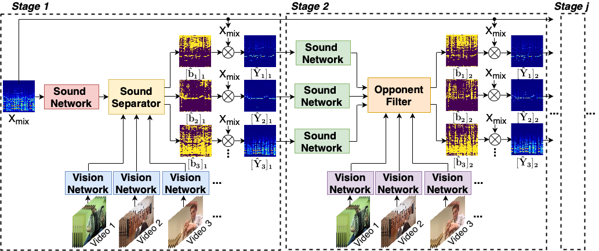

# Visually guided sound source separation using cascaded opponent filter network

[ACCV2020(**Oral**)](https://openaccess.thecvf.com/content/ACCV2020/papers/Zhu_Visually_Guided_Sound_Source_Separation_using_Cascaded_Opponent_Filter_Network_ACCV_2020_paper.pdf) | [project](https://ly-zhu.github.io/cof-net)


This repository contains PyTorch implementation of "Visually guided sound source separation using cascaded opponent filter network". Authors: [Lingyu Zhu](https://ly-zhu.github.io) and [Esa Rahtu](http://esa.rahtu.fi). Tampere University, Finland.




# Environment

Operating System: Ubuntu 18.04.4 LTS, ***CUDA=10.1, Python=3.7, PyTorch=1.3.0***


# Datasets

-The original MUSIC dataset can be downloaded from: https://github.com/roudimit/MUSIC_dataset.

-The train/val/test splits of the A-NATURAL and A-MUSIC datasets can be downloaded from [link](https://drive.google.com/drive/folders/1rjLstu2YwhxDIul0w3tFmXbtVIuD8PX4?usp=sharing). We suggest you to download the video or audio from the original [AudioSet](https://research.google.com/audioset/index.html) using the provided YouTube ID in splits files. 

-Please put the train/test split path in the scripts/train*.sh and scripts/eval.sh


# Training

./scripts/train_sSep01_C2D_DYN.sh


# Evaluation

./scripts/eval.sh


# Reference

[1] Zhao, Hang, et al. "The sound of pixels." Proceedings of the European conference on computer vision (ECCV). 2018.

[2] Zhao, Hang, et al. "The sound of motions." Proceedings of the IEEE/CVF International Conference on Computer Vision (ICCV). 2019.

[3] Xu, Xudong, Bo Dai, and Dahua Lin. "Recursive visual sound separation using minus-plus net." Proceedings of the IEEE/CVF International Conference on Computer Vision (ICCV). 2019.

[4] Gemmeke, Jort F., et al. "Audio set: An ontology and human-labeled dataset for audio events." 2017 IEEE international conference on acoustics, speech and signal processing (ICASSP). IEEE, 2017.

## Citation

If you find this work useful in your research, please cite:


```bibtex   
@inproceedings{zhu2020visually,
  title={Visually guided sound source separation using cascaded opponent filter network},
  author={Zhu, Lingyu and Rahtu, Esa},
  booktitle={Proceedings of the Asian Conference on Computer Vision},
  year={2020}
}
```

# Acknowledgement
This repo is developed based on [Sound-of-Pixels](https://github.com/hangzhaomit/Sound-of-Pixels).
